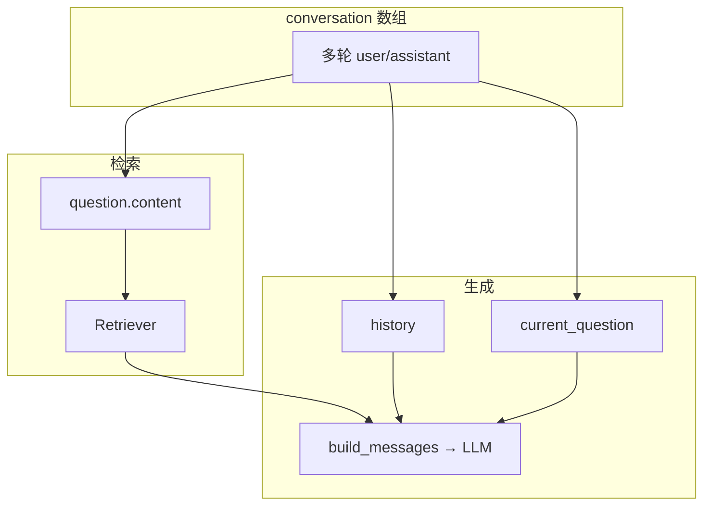
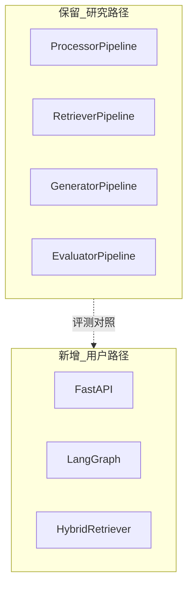

# LexRAG 对照说明：RAG 流程、多轮对话与改造指南

本文档整理 LexRAG 仓库的设计思想、多轮对话在代码中的实现方式，以及基于 LangGraph + Milvus + Elasticsearch 的用户向 RAG 改造要点。

---

## 1. LexRAG 项目定位

**LexRAG / LexiT** 是面向 **多轮法律咨询对话** 的 RAG **基准测试工具包**，不是开箱即用的在线问答产品。

| 组件 | 作用 |
|------|------|
| **Data** | `dataset.json`（1013 条 × 5 轮对话）+ `law_library.jsonl`（约 1.7 万条法条） |
| **Pipeline** | Processor → Retriever → Generator（离线批量，中间结果为 jsonl） |
| **Evaluation** | 生成指标、检索指标、LLM-as-a-Judge（含逻辑连贯性等维度） |

**论文亮点（简述）**

- 多轮法律咨询场景下的 RAG benchmark（数据 + 金标 + 语料）
- 显式对比多种 **检索 query 构建策略**（规则拼接 vs LLM 改写）
- 法律向、**分轮次** 的检索 + 生成 + Judge 统一评估框架

---

## 2. 本项目是否有 RAG？

**有。** 具备完整 RAG 链路，但是 **离线分阶段** 执行：

```
dataset.json
  → Processor（构建/改写检索 query）
  → Retriever（BM25 / BGE+Faiss → recall）
  → Generator（法条注入 Prompt + LLM）
  → Evaluator
```

- **知识库**：`law_library.jsonl` 中的法条（及可选文书、案例）
- **增强**：`LegalPromptBuilder` 将检索法条写入 system prompt
- **生成**：各类 LLM 后端批量写 `generated_responses.jsonl`

**没有**：HTTP API、实时一问一答、会话存储服务。

---

## 3. 法条与问答的关系

| 角色 | 说明 |
|------|------|
| **法条语料** | 外挂知识库，供检索；不存储用户对话 |
| **多轮对话** | `conversation` 数组中的 user/assistant 历史 |
| **系统回答** | LLM 根据 **检索到的法条 + 对话历史 + 当前问题** 生成，不是照搬语料全文 |

设计意图是 **基于检索法条作答**；Prompt 用语为「参考」法条，模型仍可能使用训练知识，严格约束需额外产品策略。

---

## 4. 多轮对话：思想与代码实现

### 4.1 核心思想

法律咨询是 **同一上下文下的递进式追问**，不是五个孤立单问。每一轮需同时处理：

1. **检索**：指代消解（「他」「这个」）→ 得到可检索的 query
2. **生成**：记住前文，回答连贯、可引条

Benchmark 将一条 5 轮对话 **拆成 5 个样本**（`id_turn1` … `id_turn5`），分别检索、生成、评分，以观察 **轮次加深是否退化**。

### 4.2 存储方式

**无** Redis / Session / 数据库。多轮信息存在于：

- `data/dataset.json`
- `data/samples/*.jsonl`（如 `rewrite_question.jsonl`）
- 检索/生成结果 jsonl 中的 `conversation` 字段

运行时从 JSON **切片** 得到 `history`，不持久化会话。

### 4.3 检索线：历史 → 一个 query 字符串

**规则策略** — `src/process/processor.py`

| `process_type` | 行为 |
|----------------|------|
| `current_question` | 仅用本轮 `user` |
| `prefix_question` | 累加此前所有 `user` |
| `prefix_question_answer` | 累加此前 user + assistant |
| `suffix_question` | 从后往前累加 `user` |

Retriever 只读每轮的 `question.content`，不把整段 conversation 直接 embedding。

**LLM 改写** — `src/process/rewriter.py`

- 将 `conversation[:conv_idx]` 格式化为「用户：… / 助理：…」
- 与当前 `user` 一起送入 LLM，产出 **独立问句**
- 写入 `question.type = "llm_question"`

**检索侧原则**：多轮对检索的贡献 = **消歧后的 query 文本**，不是把 history 存入向量库。

### 4.4 生成线：历史 → Chat messages

**按轮切片** — `src/generate/data_processor.py`

```text
history          = conv[0 : turn_num-1] 的 {user, assistant}
current_question = 本轮 user
id               = "{item_id}_turn{turn_num}"
```

**拼 Prompt** — `src/generate/prompt_builder.py`（`LegalPromptBuilder`）

```text
system（角色说明 + 本轮检索到的法条）
→ 历史各轮 user / assistant
→ 当前轮 user（再次强调本轮要问什么）
```

**生成侧原则**：历史以 **标准多轮 chat** 交给 LLM；法条放在 **system**，不写入历史 assistant 气泡。

### 4.5 检索与生成：两条线



同一轮中：

- **检索** 可能用改写后的 `question.content`
- **生成** 的当前句仍用原始 `user`（`current_question`）

这是 **刻意设计**：检索要完整可搜意图；生成保留用户原话与对话语气。

### 4.6 改写 ≠ HyDE

| | Query 改写（LexRAG） | HyDE |
|--|----------------------|------|
| LLM 输出 | 独立 **问句** | **假设性文档/答案** |
| 主要解决 | 多轮指代、上下文缺失 | query 与文档表述差距 |
| 用于检索 | 改写后的 question 文本 | 对假文档做 embedding |

LexRAG 使用前者，**未实现** HyDE。

---

## 5. 从 LexRAG 保留与替换

### 5.1 建议保留（在线系统可复用）

| 路径 | 用途 |
|------|------|
| `src/generate/prompt_builder.py` | `LegalPromptBuilder` |
| `src/process/rewriter.py` | `generate_prompt()`、改写逻辑 |
| `src/process/processor.py` | 规则 query（关闭 LLM 改写时的备选） |
| `data/law_library.jsonl` | 灌库源数据 |
| `data/samples/rewrite_question.jsonl` | 参考改写后 query 形态 |
| `src/config/template/prompt.txt` | LLM Judge 评测（可选） |

### 5.2 参考但需重写适配

| 路径 | 说明 |
|------|------|
| `src/retrieval/dense_retriever.py` | BGE + encode 思路；在线改为查 Milvus |
| `src/generate/generator.py` | OpenAI 兼容调用；在线改为单条 chat |
| `src/generate/data_processor.py` | 多轮切片逻辑 → 并入 LangGraph state |

### 5.3 在线系统不再使用

- 分阶段 jsonl：`rewrite` → `retrieval_*.jsonl` → `generated_responses.jsonl`
- `Generator._get_top_articles`（绑定 `id_turnN` 与预生成文件）
- 批量 `run_retrieval.py` + Faiss 文件索引（若已用 Milvus）
- 在线 `modelscope snapshot_download`（改用本地 `bge-base-zh-v1.5`）

### 5.4 仅评测 / 论文复现时保留

- `src/pipeline.py` 全套 Pipeline
- `src/eval/*`、`data/dataset.json`

---

## 6. 用户向 RAG 整体流程（目标架构）

### 6.1 离线：知识库构建（kb_ingest）

```text
原始法条 → 切分/清洗 → BGE 向量化 → Milvus（HNSW, COSINE, 768）
                              └→ Elasticsearch（稀疏索引）
```

### 6.2 在线：单次用户提问

```text
用户输入 + session_id
  → 加载多轮 history
  → 可选：DeepSeek 改写 retrieval_query
  → Milvus 稠密（RECALL_TOP_K）+ ES 稀疏（RECALL_TOP_K）
  → 合并去重 → bi-encoder 重排（RERANK_TOP_K）
  → 选 EVIDENCE_BUDGET 条法条
  → LegalPromptBuilder → DeepSeek 生成
  → 返回答案 + sources，写回 session
```

**环境要点（示例）**

| 配置项 | 典型值 |
|--------|--------|
| Embedding | 本地 `sentence-transformers` + `bge-base-zh-v1.5` |
| 向量库 | Milvus `civil_code`，768 维，COSINE |
| 稀疏检索 | Elasticsearch |
| 生成 | DeepSeek API（OpenAI 兼容） |
| 编排 | LangGraph |
| Tavily | 法律场景 **建议默认关闭** |

**检索参数建议**

- `RECALL_TOP_K`：Milvus、ES 各取若干条候选
- `RERANK_TOP_K`：送入重排器的候选上限
- `EVIDENCE_BUDGET`：最终写入 Prompt 的法条条数（如 2）

### 6.3 与研究流水线的关系



两套路径可共享语料与 Prompt 逻辑，在线路径不依赖 `dataset.json` 批量 jsonl。

---

## 7. LangGraph 中的多轮对话

### 7.1 推荐状态

```python
class LegalRAGState(TypedDict):
    messages: Annotated[list[AnyMessage], add_messages]  # 用户可见对话
    retrieval_query: str                                  # 检索专用
    sources: list[dict]                                   # 引用法条
```

### 7.2 字段分工

| 字段 | 内容 |
|------|------|
| `messages` | 仅 Human / AI 轮次，不塞法条全文 |
| `retrieval_query` | 改写后的独立问句 |
| `sources` | 最终进 Prompt 的法条 |
| 生成输入 | `LegalPromptBuilder` 构造：system（含法条）+ history + 当前 user |

### 7.3 与 LexRAG 代码对齐

从 `messages` 转为 LexRAG 的 `history` + `current_question`，再调用 `LegalPromptBuilder.build_messages()`，无需改 Prompt 模块。

### 7.4 会话存储

| 阶段 | 方案 |
|------|------|
| MVP | LangGraph `MemorySaver` + `thread_id = session_id` |
| 生产 | Redis / Sqlite checkpointer |

**原则**：每轮用户提问 **重新检索**，不缓存第一轮法条。

### 7.5 图节点（示意）

```text
ingest → rewrite? → hybrid_retrieve → rerank → select_evidence
      → build_prompt → generate → persist
```

---

## 8. LexRAG 文件 → 新系统模块映射

| LexRAG | 用户向系统 |
|--------|------------|
| `law_library.jsonl` | kb_ingest → Milvus + ES |
| `processor.py` / `rewriter.py` | LangGraph `build_query` / `rewrite_query` |
| `dense_retriever.py` | Embedding + Milvus |
| `run_retrieval.py` | `HybridRetriever` |
| `LegalPromptBuilder` | `build_prompt` 节点 |
| `generator.py` | `DeepSeekClient` |
| `dataset.json` | 离线评测 only |

---

## 9. 实施顺序建议

1. 确认 Milvus / ES 已灌库（维度与 BGE 一致）
2. 单测 HybridRetriever + Reranker
3. LangGraph + DeepSeek（可先关 rewrite / Tavily）
4. 多轮 session + rewrite
5. FastAPI + 前端，返回 `answer` + `evidence`
6. 免责声明：仅供参考，不构成法律意见

---

## 10. 相关源码索引

| 主题 | 文件 |
|------|------|
| 规则 query | `src/process/processor.py` |
| LLM 改写 | `src/process/rewriter.py` |
| 按轮切片 | `src/generate/data_processor.py` |
| Prompt | `src/generate/prompt_builder.py` |
| 批量生成 | `src/generate/generator.py` |
| 稠密检索 | `src/retrieval/dense_retriever.py` |
| 批量检索 | `src/retrieval/run_retrieval.py` |
| 流水线入口 | `src/pipeline.py` |
| Judge 模板 | `src/config/template/prompt.txt` |

---

*文档版本：基于 LexRAG 仓库结构与改造讨论整理。*
